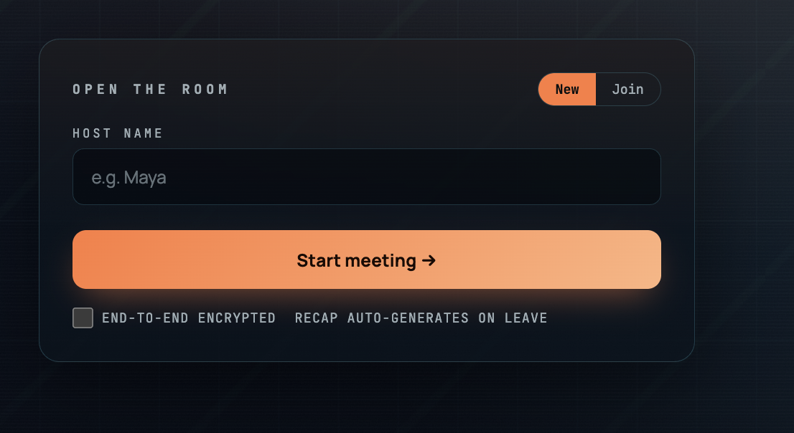
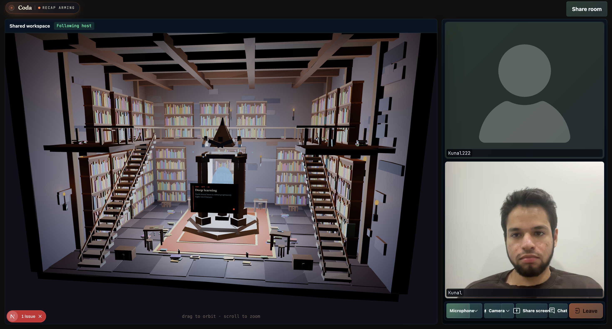
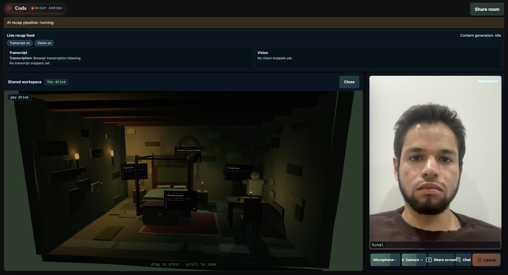
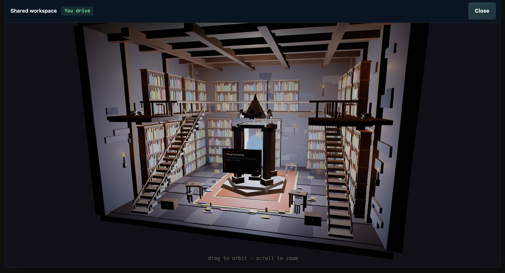

<p align="center">
  
</p>

# Coda

> Meetings, reconstructed.
>
> Talk freely. We'll write the recap, the deck, the quiz.

Coda turns the moment you hang up into nine learning artifacts — a written report, an audio podcast, a slide deck, a mind map, flashcards, a quiz, an infographic, a data table, and a video. Generated automatically. Available for download before everyone finishes saying goodbye.

And while you're still in the room — share an **interactive 3D space** with everyone on the call. Walk a candlelit library, orbit a stone bedroom, or drop your own scene. Cursors sync, the host steers, and your past meeting's artifacts are already pinned to the walls.

## Demo

Watch the walkthrough on YouTube: **<https://youtu.be/3CKrapzaJ-k>**

A local copy of the demo reel lives at [`meet-main/.github/assets/coda/coda.mp4`](./meet-main/.github/assets/coda/coda.mp4).

## What it looks like

| Open the room | In a shared world |
|---|---|
|  |  |

**Worlds, not slides.** The host shares a navigable 3D scene instead of a deck. Cursors and camera state sync over LiveKit data channels.

| Control room | Library |
|---|---|
|  |  |

## What's in the box

- **Live meeting** — LiveKit audio/video room with prejoin device check, screen share, chat, end-to-end encryption.
- **Shared 3D workspace** — pick a default world (control room, library, bedroom) or upload your own scene. Host-led tour syncs camera + selection across every participant.
- **Live recap pipeline** — browser-side speech transcription + screen vision snapshots feed an agent service that summarizes the conversation in real time.
- **Auto-generated recap** — when the host leaves, Coda assembles the nine artifacts (report, podcast, deck, mind map, flashcards, quiz, infographic, data table, video) and serves them at `/recap/[meetingId]`.
- **Plain files. Yours to keep.** — every artifact is downloadable; no login wall.

## Tech stack

- [Next.js 15](https://nextjs.org/) (App Router) + React 18
- [LiveKit Components](https://github.com/livekit/components-js) (`@livekit/components-react`, `livekit-client`, `livekit-server-sdk`)
- [Krisp noise filter](https://www.npmjs.com/package/@livekit/krisp-noise-filter) and [`@livekit/track-processors`](https://www.npmjs.com/package/@livekit/track-processors)
- Browser `SpeechRecognition` for live transcription
- Companion Python agent service (FastAPI + Pipecat) for KG extraction, world generation, and recap artifacts — see [`agent/`](./agent) and [`content-generation-api/`](./content-generation-api)
- Datadog browser logs, Vitest, Prettier, ESLint, pnpm

## Dev setup

```bash
cd meet-main
pnpm install
cp .env.example .env.local        # fill LiveKit keys + agent URLs
pnpm dev                          # http://localhost:3000
```

### Useful scripts

| Command | What it does |
|---|---|
| `pnpm dev` | Local dev server on `localhost:3000` |
| `pnpm dev:lan` | Bind on `0.0.0.0:3000` to test from a second device on the LAN (camera/mic blocked over insecure HTTP — use HTTPS or a tunnel for full feature) |
| `pnpm build` / `pnpm start` | Production build + start |
| `pnpm test` | Vitest unit tests (browser speech transcription, etc.) |
| `pnpm lint` / `pnpm lint:fix` | ESLint |
| `pnpm format:check` / `pnpm format:write` | Prettier |

### LAN testing (two devices)

Use `pnpm dev:lan` to expose the app on your local network, then open `http://<your-lan-ip>:3000` on another device. Room join works over LAN HTTP; camera/mic require HTTPS or a secure tunnel.

## AI recap pipeline (optional)

This repo can stream host screen-share frames and meeting transcript signals to a separate Python service that turns them into the recap bundle.

1. Start the agent service from `./agent`:

   ```bash
   python3.13 -m venv .venv313
   source .venv313/bin/activate
   pip install -r requirements.txt
   cp .env.example .env
   uvicorn agent.main:app --host 0.0.0.0 --port 8787 --reload
   ```

2. In `meet-main/.env.local`, set:

   ```env
   NEXT_PUBLIC_AI_PIPELINE_ENABLED=true
   AI_AGENT_BASE_URL=http://127.0.0.1:8787
   ```

3. Join as host, start screen share, and the app will:
   - start an AI session,
   - sample screen frames at 1 fps,
   - forward frames to the agent,
   - poll rolling/final summaries.

The host's leaving the room triggers the final artifact bundle — you can find it at `/recap/[meetingId]` and on the artifact storage prefix in the agent service.

## Project layout

```
meet-main/
├── app/
│   ├── api/              # connection-details, recording, world & recap endpoints
│   ├── custom/           # custom prejoin / branding
│   ├── recap/[id]/       # auto-generated artifact viewer
│   └── rooms/[name]/     # the meeting itself (LiveKit room + shared world)
├── components/           # CodaMark, WorldRoom, CityScene, Recap*, etc.
├── lib/                  # useWorldSync, world API client, types, hotkeys
├── public/               # static worlds + assets
├── styles/               # global + module CSS
└── .github/assets/coda/  # the screenshots in this README
agent/                    # Python recap pipeline (FastAPI + Pipecat)
content-generation-api/   # artifact generation service
```

## License

Apache 2.0 — see [LICENSE](./meet-main/LICENSE). Built on [LiveKit Meet](https://github.com/livekit/meet) (also Apache 2.0).
